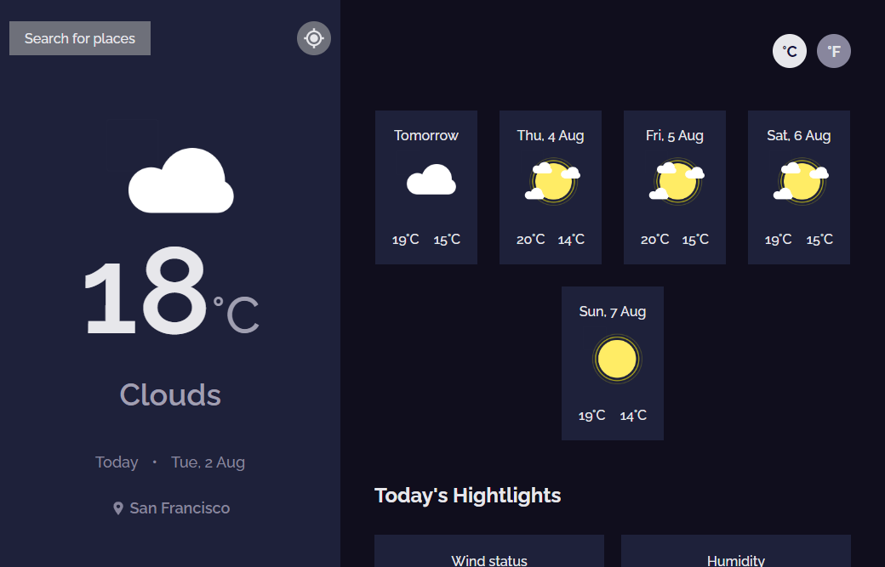

# Weather App

A complete Weather App using React and Webpack

## Preview

[Link](https://weather-dev-app.netlify.app/)

## Getting Started

1. Clone this project
2. Go to project's folder
3. Run and have fun ;) `npm start`

## Scripts

- `npm run start` to development environment
- `npm run build` && `npm serve` to production

## Technologies

- React
- Webpack

## License

MIT
